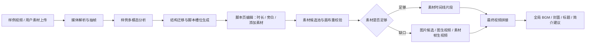

# 迁镜（ShotSwift）

产品名称：迁镜（ShotSwift）

项目全称：爆款结构迁移引擎：样例驱动的视频结构迁移与 AI 改片 Agent

团队名称：随机队友生成队

## 项目定位

本项目面向短视频广告创作，目标是把“看懂爆款样例”转化为“可编辑、可补全、可导出”的视频结构迁移工作台。

用户上传若干样例视频和自己的素材后，系统会拆解样例中的分镜结构、节奏逻辑、视觉包装和商业说服链路，再结合用户的新主题、新产品和真实素材，生成新的广告结构、素材匹配表、画布缺口、AI 补全提示词、最终拼接视频、封面建议和 BGM。

当前 V2 主链路聚焦商业广告短视频，已覆盖：

- 样例分析：多样例视频抽帧、分镜描述、迁移可能性。
- 结构迁移：生成面向新产品的分镜结构和时长分配。
- 素材理解：按用户上传素材建立候选池，识别可用分镜和缺口。
- 画布重校验：根据最新素材、时长和用户新增素材重新匹配。
- AI 补全：支持素材帧直出视频、先生图再图生视频。
- 最终导出：拼接真实素材和 AI 补全片段，生成全局 BGM、封面标题和简介建议。

## 整体 AI 架构

V2 采用 API-first 的多阶段 Agent 架构。每个阶段都有明确输入输出，真实 provider 不可用时可以降级到 deterministic fallback，方便本地开发和演示验证。

核心设计原则：

- 样例只迁移结构、节奏和表达方法，不复制样例的品牌、人物或具体画面。
- 用户素材不是成片节奏的唯一依据。最终节奏优先服从用户目标、目标时长和广告信息密度。
- 素材分配在进入画布时重新计算；脚本页只保存结构和用户上传到对应分镜的素材。
- 同一源视频默认只自动服务一个分镜，避免把一个完整动作拆成多个分镜导致重复倒茶、重复喝水等问题。
- 缺口优先显式暴露给前端，用户可以继续添加素材或触发 AI 补全。

## 工具协议

本项目把外部 AI 能力视为工具 provider，通过统一协议接入，而不是让前端直接调用模型。

### Provider 类型

| 能力 | 当前用途 | 配置前缀 |
| --- | --- | --- |
| 多模态理解 | 样例分析、素材理解、生成视频裁剪评审 | `V2_MULTIMODAL_*` |
| 文生图 | 缺口候选图、封面候选图 | `V2_IMAGE_*` |
| 图生视频 | 缺口视频补全 | `V2_VIDEO_*` |
| Text-to-Music | 最终全局 BGM | `V2_BGM_*` |

### 调用约定

- 后端负责读取 `.env` 中的 provider endpoint、model 和 key。
- 前端只拿业务结果和媒体 URL，不接触任何 provider key。
- 多模态阶段要求模型返回 JSON object；返回非法 JSON 时后端会尝试修复或 fallback。
- 图片/视频/BGM provider 的原始响应会被包装进后端业务字段，方便调试和审计。
- 生成视频进入最终拼接前会经过裁剪评审，确保剪入时长和缺口时长一致。
- BGM provider 如果生成更长音频，最终导出会按视频时长裁切和淡出。

## 安全边界

安全边界按“前端、后端、本地文件、外部 provider”四层划分。

### 前端边界

- 前端不得读取或保存 API key。
- 前端使用 `file_id`、`uri`、`final_video_url` 等后端返回的媒体引用，不依赖本地绝对路径。
- 用户只能编辑允许编辑的字段：分镜时长、旁白文本、素材上传和画布操作。AI 结构判断字段默认锁定。

### 后端边界

- API key 只从 `.env` 读取，不写入响应、不提交到仓库。
- 上传文件通过 `file_id` 访问，下载和媒体 serving 必须经过后端解析，避免直接暴露任意文件路径。
- 文件名、session id、candidate pool id 都会做安全化处理，防止路径穿越。
- 生成媒体先落在 `outputs/` 下，再通过受控 API URL 暴露。

### AI 边界

- 样例视频只做结构迁移，不要求复刻品牌、人物、台词或受版权保护的具体内容。
- 生成 prompt 会明确禁止无关品牌、乱码文字、错误包装和畸形主体。
- 模型输出不能直接被视为可信执行指令；后端只解析预期 JSON 字段。
- 外部 provider 失败时允许 fallback，但 fallback 会在响应中标明来源和原因。

### 导出边界

- 最终拼接默认静音源素材音频，避免把未经处理的原始声音带入成片。
- 中间补全片段不单独生成 BGM，最终成片只拥有一条全局 BGM。
- 未补全缺口进入导出时，当前策略是跳过缺口对应片段；如果传入目标时长且实际时长不匹配，后端会报错。

## 仓库文档

- [代码说明与运行手册](docs/codebase-runbook.md)
- [Backend API Contract](docs/backend-api-contract.md)
- [P0 Pipeline Demo Guide](docs/p0-pipeline-demo-guide.md)
- [团队协作与 Git 工作流](docs/team-collaboration-workflow.md)
- [GitHub 小白使用手册](docs/github-beginner-guide.md)

## 当前状态

当前主验证分支为 `v2`。V2 后端真实链路已完成样例分析、结构迁移、画布缺口补全、最终拼接、封面/标题/简介建议和 ModelsLab BGM 接入。
